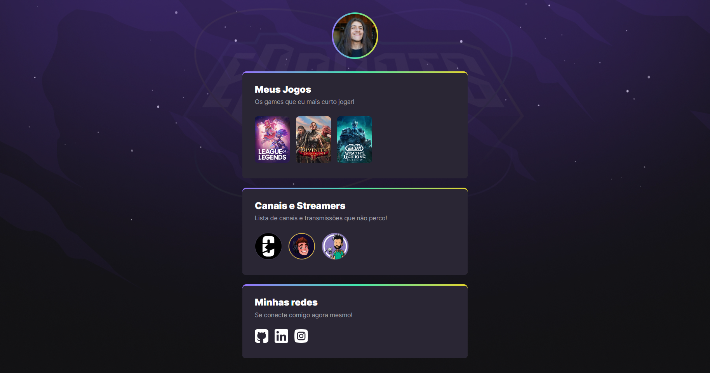

# NLW eSports - Trilha Explorer

> Trilha Explorer

Projeto construido do evento Next Level Week da Rocketseat.

## Tecnologias 

-HTML
-CSS
-GIT e Github

## O que aprendi

Além da oportunidade de praticar conhecimento pré-existentes, tive o prazer de aprender sobre algumas funcionalidas do CSS que não conhecia antes e que com certeza vão alterar a forma com que faço os meus próximos projetos.

## Contato

paulomv29@oulook.com
